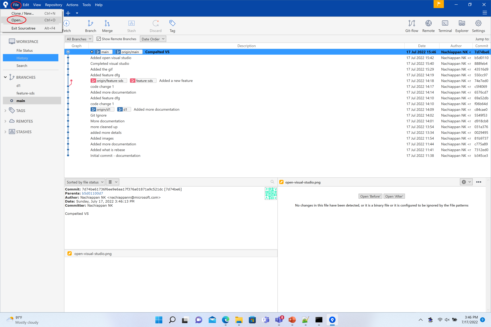
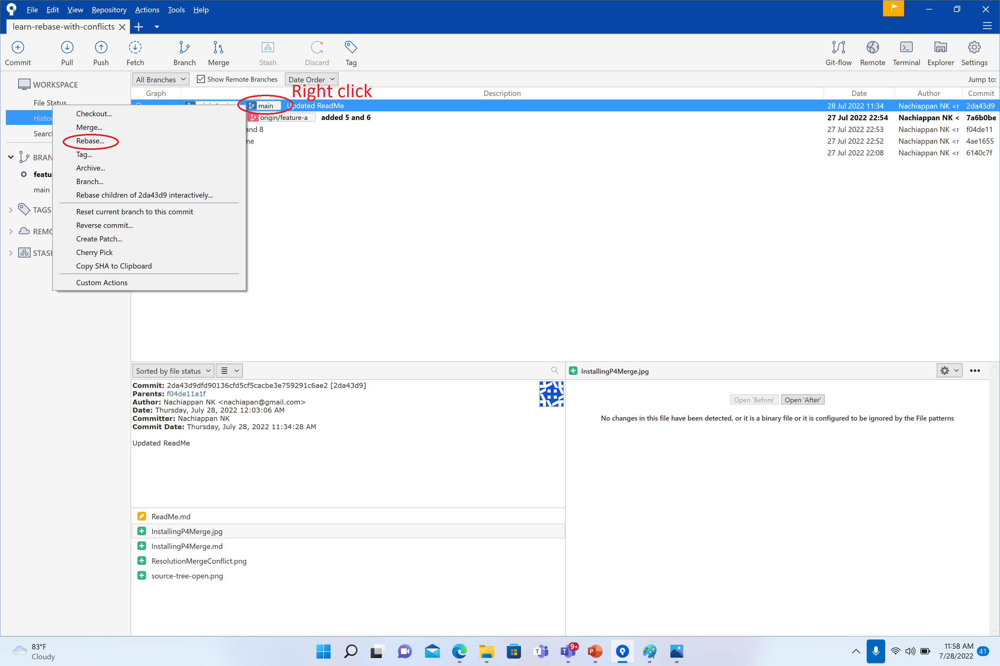

# Rebase with Merge Conflicts

## 3 Way Merge Conflict Resolution
- Base is the common ancestor. All Changes from base has to be in the merged version
- Version 1 is the branch on to which we are rebasing - called local
- Version 2 is the branch that we are rebasing - called remote
- Merge conflict resolution is resolving the conflicting changes between version1 and version2

## Steps to rebase when merge conflicts
- Rebase command
- Resolve conflicts and commit
- Rebase continue command

## Resolving conflicts
- Resolving conflicts with out tool can be tedious
- There are many tools that help in merge conflict resolution
- P4Merge is a tool that is good for 3 way merge

## Installing p4merge
- Please check out [this](https://github.com/GetGitReady/learn-rebase-with-conflicts/blob/main/InstallingP4Merge.md)

## Source Tree With P4Merge
- Make sure to install p4 merge
- Clone the repo wiht the command `git clone https://github.com/GetGitReady/learn-rebase-with-conflicts.git`
- Open the repo in Source Tree

- Ensure Remote branches are visible

- Checkout feature branch `feature-a`

- Ensure feature branch is checked out

- Rebase on to main

- Resolve conflicts using merge tool and commit

- Rebase on to main with continue option

